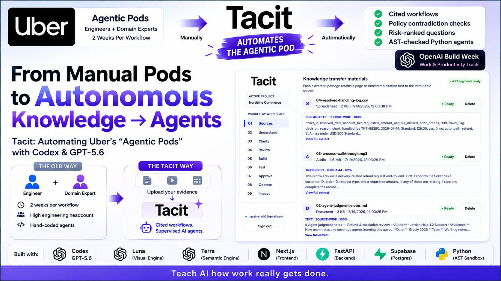
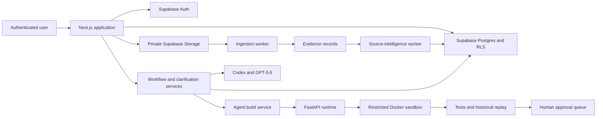

<p align="center">
  
</p>

<h1 align="center">Tacit</h1>

<p align="center">
  <strong>From expert knowledge to trusted AI agents.</strong>
</p>

<p align="center">
  Tacit learns from documents, walkthroughs, examples, and expert judgment, then turns that knowledge into a cited workflow and a supervised AI agent that teams can inspect, test, and approve.
</p>

<p align="center">
  <a href="#how-tacit-works">How it works</a> ·
  <a href="#core-capabilities">Capabilities</a> ·
  <a href="#codex-and-gpt-56">Codex & GPT-5.6</a> ·
  <a href="#architecture">Architecture</a> ·
  <a href="#getting-started">Getting started</a>
</p>

<p align="center">
  
  
  
  
  
  
  
  
</p>

> **Live demo:** [tacit.thryveapps.in](https://tacit.thryveapps.in)
> **Demo video:** [YouTube](https://youtu.be/CCqIR12CTLY)
> **Devpost:** [Tacit: Automating Uber's Agentic Pods with Codex & GPT-5.6](https://devpost.com/software/tacit-automating-uber-s-agentic-pods-with-codex-gpt-5-6)

<p align="center">
  
</p>

---

## Overview

Uber’s **Agentic Pods** pair AI engineers with domain experts to observe real work and build specialized agents.

The approach can produce valuable agents, but every workflow requires engineers to interview experts, study documents, understand exceptions, write custom code, and test the result.

**Tacit automates much of the Agentic Pod itself.**

Domain experts provide the materials they already use:

* SOPs and policy documents
* Spreadsheets
* Images and screenshots
* Audio recordings
* Walkthrough videos
* Historical cases and real examples

Tacit analyzes the evidence, identifies missing or conflicting information, asks focused clarification questions, creates a cited workflow, and compiles a supervised AI agent.

---

## The problem

Traditional automation often starts with an incomplete SOP.

The knowledge that makes a real process safe usually lives in:

* Exceptions and edge cases
* Expert judgment
* Unwritten business rules
* Workarounds
* Approval boundaries
* Decisions to stop and ask for help

AI can generate a plausible workflow even when essential information is missing. Tacit is designed to expose that uncertainty rather than hide it.

Every workflow step, clarification, rule, build, test result, and approval remains connected to supporting evidence.

---

## How Tacit works

1. **Create a project**
   Start a tenant-owned knowledge-transfer project.

2. **Add source material**
   Upload documents, spreadsheets, images, audio, videos, and historical examples.

3. **Understand the evidence**
   Background workers extract content, preserve page or timestamp references, identify relationships, and detect contradictions.

4. **Generate the workflow**
   Tacit creates a visual workflow containing process steps, decision rules, risks, confidence, and supporting evidence.

5. **Clarify missing knowledge**
   Risk-ranked questions are shown when Tacit cannot safely determine a rule. Answers create a new workflow version.

6. **Review and confirm**
   A subject-matter expert reviews the rules, contradictions, automation boundaries, and approval policies.

7. **Build the agent**
   Tacit generates constrained Python code and tests from the confirmed workflow.

8. **Test and approve**
   Teams replay historical cases, inspect individual results, and route uncertain decisions to a human approval queue.

9. **Operate with supervision**
   Deployment readiness, operating feedback, overrides, and impact estimates remain visible and auditable.

---

## Core capabilities

### Multimodal knowledge ingestion

| Source       | Supported formats        | Processing                                     |
| ------------ | ------------------------ | ---------------------------------------------- |
| Documents    | PDF, DOCX, TXT, Markdown | Text extraction with source references         |
| Spreadsheets | CSV, XLSX                | Structured data extraction                     |
| Images       | PNG, JPG, JPEG, WebP     | Visual analysis and OCR                        |
| Audio        | MP3, M4A, WAV, WebM      | Timestamped transcription                      |
| Video        | MP4, MOV, WebM           | Audio transcription and sampled frame analysis |

### Evidence-backed workflows

Tacit generates an interactive workflow where each step can expose:

* Inputs and outputs
* Decision rules
* Exceptions
* Confidence
* Risk level
* Automation recommendation
* Supporting files, pages, and timestamps

### Clarification and version control

Tacit asks questions instead of silently inventing missing rules.

Experts can answer or defer a clarification. Accepted answers and workflow changes create new versions, preserving a complete history of how the process evolved.

### Supervised agent generation

Agents are generated only from a reviewed and confirmed workflow, not directly from raw source files.

Each build includes:

* Generated Python code
* Generated tests
* Static validation
* Repair attempts when validation fails
* Immutable build artifacts
* Explicit promotion before use

### Historical replay and approvals

Teams can import labelled historical cases, run them against a promoted agent, inspect the results, and measure accuracy.

Cases requiring human judgment create approval requests containing:

* Agent recommendation
* Confidence
* Applied rules
* Evidence references
* Agent rationale

### Readiness and impact

Tacit evaluates readiness using:

* Historical replay accuracy
* Open clarification questions
* Unresolved contradictions
* Workflow confirmation state
* Human-review requirements

The Impact workspace provides conservative estimates for automation coverage, review workload, handling time, discovered rules, and operational value.

---

## Codex and GPT-5.6

Tacit was created for **OpenAI Build Week** in the **Work & Productivity** track.

**Codex and GPT-5.6 were essential both to building the application and to its production workflow.**

### Development

Codex and GPT-5.6 supported development across the complete codebase, including:

* Next.js frontend components
* FastAPI services
* PostgreSQL schemas and RLS policies
* Evidence-processing workers
* Workflow and validation schemas
* AST-based runtime safety
* Unit, integration, and end-to-end tests
* Documentation and product refinement

### Product workflow

Within Tacit, Codex and GPT-5.6 help:

* Analyze confirmed workflow structures
* Generate risk-ranked clarification questions
* Convert approved workflows into executable Python agents
* Generate expected-behavior and edge-case tests
* Repair generated code when validation fails

This makes Codex and GPT-5.6 part of the product itself, not only tools used during development.

### Additional model paths

Tacit also supports specialized AI paths:

* **Terra** for semantic analysis, structural extraction, and cross-source contradiction detection
* **Luna** for image interpretation, video-frame analysis, and visual walkthrough understanding

---

## Application workspace

| Area           | Purpose                                                          |
| -------------- | ---------------------------------------------------------------- |
| **Sources**    | Upload, inspect, retry, classify, and delete source material     |
| **Understand** | Review cited insights and cross-source relationships             |
| **Clarify**    | Resolve or defer risk-ranked questions                           |
| **Review**     | Inspect the workflow and propose controlled changes              |
| **Build**      | Generate, validate, test, repair, and promote an agent           |
| **Test**       | Replay historical cases and run supervised examples              |
| **Approve**    | Review decisions requiring human judgment                        |
| **Operate**    | Evaluate readiness and record operating feedback                 |
| **Impact**     | Review automation, accuracy, workload, and time-saving estimates |

<details open>
<summary>Recorded Codex feedback sessions</summary>

| Milestone | Session ID |
| --- | --- |
| 0 | `019f6550-4f79-7ea1-bfcb-0ff381635ee5` |
| 1 | `019f656f-697c-7372-9ebe-e20acad2dec6` |
| 2 | `019f65a1-b896-78d0-bb9a-6b17bf069623` |
| 3 | `019f65bd-a0c0-7e30-af90-f358681c505a` |
| 4 | `019f65d6-5790-73e1-8237-a725a98bb0f7` |
| 5 | `019f6611-6752-7de2-8fe7-7add76cb2cee` |
| 6 | `019f6626-7c7e-7c83-a243-43eb24186587` |
| 7 | `019f6644-00a9-7ca2-909b-6ae90b2d1bb1` |
| 8 | `019f6688-b0b8-7d41-841c-6c0200573854` |
| 9 | `019f66a7-67b3-79d3-a8e7-517f4de8ab9c` |
| 10 | `019f6868-2613-7870-91d4-7a43892ee49e` |
| 11 | `019f6872-6d2b-73d1-84f0-52a3e870aa1f` |

</details>

---

## Product screenshots

<p align="center">
  
</p>

<p align="center">
  <em>Sources: Upload and process expert knowledge across supported formats.</em>
</p>

<p align="center">
  
</p>

<p align="center">
  <em>Understand: Review cited insights, source relationships, and contradictions.</em>
</p>

<p align="center">
  
</p>

<p align="center">
  <em>Review: Inspect workflow steps, evidence, risks, and automation boundaries.</em>
</p>

<p align="center">
  
</p>

<p align="center">
  <em>Build: Generate and validate constrained agent code.</em>
</p>

<p align="center">
  
</p>

<p align="center">
  <em>Test: Replay historical cases before broader use.</em>
</p>

<p align="center">
  
</p>

<p align="center">
  <em>Approve: Keep high-risk and uncertain decisions under human control.</em>
</p>

<p align="center">
  
</p>

<p align="center">
  <em>Impact: Review conservative estimates for automation, accuracy, workload, and operational savings.</em>
</p>

---

## Technology stack

| Area                | Technology                                      |
| ------------------- | ----------------------------------------------- |
| Frontend            | Next.js 15, React 19, TypeScript                |
| Workflow UI         | React Flow via `@xyflow/react`                  |
| API layer           | Next.js route handlers, Zod, FastAPI            |
| Runtime             | Python 3.11, Pydantic, Docker                   |
| Authentication      | Supabase Auth                                   |
| Database            | Supabase Postgres with Row Level Security       |
| Storage             | Private Supabase Storage                        |
| AI                  | Codex, GPT-5.6, Terra, Luna                     |
| Evidence processing | pypdf, python-docx, openpyxl, Tesseract, FFmpeg |
| Testing             | Vitest, Playwright, pytest, Ruff, ESLint        |

---

## Architecture



### Data flow

1. A user uploads validated source files.
2. Workers extract text, structured data, transcripts, and visual frames.
3. Source intelligence creates cited insights and relationships.
4. Tacit generates an evidence-backed draft workflow.
5. Experts resolve important questions and confirm policy boundaries.
6. Codex and GPT-5.6 generate a constrained agent and tests.
7. The runtime validates and executes the agent in an isolated container.
8. Test results, approvals, and operating feedback are stored for review.

---

## Safety and governance

Generated code is treated as untrusted.

Before execution, Tacit:

* Parses the Python abstract syntax tree
* Allows only approved imports
* Rejects dangerous modules and functions
* Requires a stable `evaluate(payload)` entry point
* Runs generated code without network access
* Uses a read-only filesystem
* Drops container capabilities
* Runs as an unprivileged user
* Enforces CPU, memory, process, file, input, output, and time limits

Additional controls include:

* Evidence-linked workflow rules
* Explicit uncertainty and contradiction states
* Human confirmation before building
* Versioned workflow changes
* Static checks and generated tests
* Explicit build promotion
* Human approval boundaries
* Tenant isolation through Supabase RLS
* Persistent audit records

Tacit does not claim a compliance certification and does not autonomously perform high-risk actions such as releasing payments.

---

## Getting started

### Prerequisites

Install or configure:

* Node.js 20+
* npm 10+
* Python 3.11+
* Docker Desktop
* A Supabase project
* An approved AI backend:

  * OpenAI API credentials and model IDs, or
  * A private Codex subscription runner

### 1. Clone the repository

```bash
git clone <repository-url>
cd tacit
```

### 2. Install dependencies

```bash
npm ci
python -m pip install -e apps/agent-runtime
python -m pip install ruff
```

### 3. Create environment files

macOS or Linux:

```bash
cp .env.example .env
cp apps/web/.env.local.example apps/web/.env.local
```

Windows PowerShell:

```powershell
Copy-Item .env.example .env
Copy-Item apps/web/.env.local.example apps/web/.env.local
```

The root `.env` is used by Docker Compose and its workers. `apps/web/.env.local` is used when Next.js runs outside Compose. Put the same required Supabase and AI values in both when using the corresponding mode.

Never expose service-role keys, model credentials, or runner secrets in client code or source control.

### 4. Prepare Supabase

For a new Supabase project, enable email/password Auth and add the local or deployed application URL to the Auth redirect/site-URL settings. Then apply the repository migrations; this initializes tenant isolation, storage policies, evidence jobs, and the production workspace schema.

```bash
npx supabase init
npx supabase login
npx supabase link --project-ref <your-project-ref>
npx supabase db push --dry-run
npx supabase db push
```

Use a new or otherwise empty project for this flow. Do not run `db reset` against a project containing real customer data. The migration files are kept in `supabase/migrations/` and are applied in timestamp order.

### 5. Build the agent sandbox

```bash
docker build \
  -f apps/agent-runtime/Dockerfile.sandbox \
  -t tacit-agent-sandbox:latest \
  apps/agent-runtime
```

### 6. Start the complete stack

```bash
docker compose up --build -d
```

The full production path requires all five services: `web`, `agent-runtime`, `ingestion-worker`, `source-intelligence-worker`, and `codex-runner`. The two `NEXT_PUBLIC_SUPABASE_*` values must be present in the root `.env` before this command because Next.js embeds them when building the web image.

View service logs:

```bash
docker compose logs -f \
  web \
  codex-runner \
  agent-runtime \
  ingestion-worker \
  source-intelligence-worker
```

Open:

```text
http://localhost:3000
```

Health endpoints:

```text
http://localhost:3000/api/health
http://localhost:8001/health
```

Open `http://localhost:3000/projects`, create or sign in to a real account, create an organization and project, and upload source evidence. This is the same authenticated product path used in the submitted deployment.

---

## Codex subscription runner

Tacit supports a private Codex subscription runner as an alternative AI backend.

Set:

```env
LLM_BACKEND=codex_subscription
CODEX_SUBSCRIPTION_RUNNER_URL=http://codex-runner:8100
CODEX_SUBSCRIPTION_RUNNER_SECRET=<strong-random-secret>
CODEX_SUBSCRIPTION_MODEL=<configured-model>
```

Start the runner:

```bash
docker compose up -d codex-runner
```

Complete the one-time device-code login:

```bash
docker compose exec codex-runner python -m app.codex_login
```

Inside Compose, the runner URL is `http://codex-runner:8100`. When running a web process outside Compose, use `http://localhost:8100`. Compose binds the runner to loopback (`127.0.0.1:8100`) and stores authentication state in the `codex-subscription-auth` Docker volume.

Do not expose the runner publicly or share its credential volume.

---

## OpenAI API backend

To use the OpenAI API path:

```env
LLM_BACKEND=openai_api
OPENAI_API_KEY=<your-server-side-key>

OPENAI_REASONING_MODEL=<approved-model-id>
OPENAI_DEFAULT_MODEL=<approved-model-id>
OPENAI_FAST_MODEL=<approved-model-id>
OPENAI_CODEX_MODEL=<approved-model-id>
```

Model identifiers are configured through environment variables rather than hardcoded into the application.

---

## Important environment variables

| Variable                           | Purpose                              |
| ---------------------------------- | ------------------------------------ |
| `NEXT_PUBLIC_SUPABASE_URL`         | Supabase project URL                 |
| `NEXT_PUBLIC_SUPABASE_ANON_KEY`    | Browser authentication key           |
| `SUPABASE_SERVICE_ROLE_KEY`        | Server and worker access             |
| `AGENT_RUNTIME_URL`                | FastAPI runtime URL                  |
| `LLM_BACKEND`                      | `openai_api` or `codex_subscription` |
| `OPENAI_API_KEY`                   | Server-side OpenAI credential        |
| `OPENAI_REASONING_MODEL`           | Reasoning model ID                   |
| `OPENAI_CODEX_MODEL`               | Code-generation model ID             |
| `CODEX_SUBSCRIPTION_RUNNER_URL`    | Private Codex runner endpoint        |
| `CODEX_SUBSCRIPTION_RUNNER_SECRET` | Shared runner secret                 |
| `CODEX_SUBSCRIPTION_MODEL`         | Codex subscription model             |
| `EVIDENCE_TRANSCRIPTION_MODEL`     | Audio and video transcription model  |
| `EVIDENCE_VISION_MODEL`            | Vision-capable source model          |
| `AGENT_SANDBOX_IMAGE`              | Docker sandbox image                 |
| `AGENT_EXECUTION_TIMEOUT_SECONDS`  | Agent execution timeout              |
| `NEXT_PUBLIC_DEMO_MODE_ENABLED`    | Enables the seeded demo route        |

Refer to `.env.example` and `apps/web/.env.local.example` for the complete configuration.

---

## Local development

For the real end-to-end path, prefer the Compose instructions above because they start the runtime and both durable-evidence workers with the required environment. For focused UI/runtime development, start these in separate terminals:

```bash
npm run dev
npm run runtime:dev
```

`npm run dev` reads `apps/web/.env.local`. Python does not automatically read `.env`; export the root environment before running workers directly, or use Compose. To run workers outside Compose after exporting that environment:

```bash
docker compose up -d codex-runner

cd apps/agent-runtime
python -m app.ingestion_worker
python -m app.source_intelligence_worker
```

---

## Project structure

```text
apps/
  web/                         Next.js UI and API routes
  agent-runtime/               FastAPI runtime and workers

packages/
  core-schemas/                Shared application contracts
  prompts/                     Prompt construction
  workflow-sdk/                Workflow-pack utilities
  workflow-registry/           Workflow-pack registration

supabase/
  migrations/                  Database, RLS, Storage, and audit migrations

scripts/                       Seed and demo-reset scripts
generated/                     Local generated-agent artifacts
```

---

## Available commands

| Command                | Purpose                              |
| ---------------------- | ------------------------------------ |
| `npm run dev`          | Start the Next.js development server |
| `npm run build`        | Build the production web application |
| `npm run lint`         | Run ESLint                           |
| `npm run typecheck`    | Run TypeScript checks                |
| `npm run test`         | Run Vitest tests                     |
| `npm run test:e2e`     | Run Playwright tests                 |
| `npm run runtime:dev`  | Start FastAPI with reload            |
| `npm run runtime:lint` | Run Ruff                             |
| `npm run runtime:test` | Run pytest                           |
| `npm run seed`         | Seed local data                      |
| `npm run demo:reset`   | Reset explicit demo data             |

---

## Testing

Run the standard quality checks:

```bash
npm run lint
npm run typecheck
npm run test
npm run runtime:lint
npm run runtime:test
npm run build
```

Run end-to-end tests:

```bash
npx playwright install chromium
npm run test:e2e
```

The developer test suite is separate from Tacit’s in-product Test workspace, which evaluates promoted agents against tenant-owned historical cases.

---

## Deployment notes

The repository supports a local, production-style Docker Compose topology containing:

* Next.js web application
* FastAPI agent runtime
* Ingestion worker
* Source-intelligence worker
* Private Codex runner
* Restricted generated-agent sandbox

A recreation from GitHub needs its own Supabase project, AI credentials or a private Codex subscription login, and Docker-capable worker hosting. The submitted Supabase project, Codex login state, and server-side secrets are intentionally not committed. Therefore a fresh clone can reproduce the real product topology, but cannot connect to the submitted tenant without the separate test account and deployment URL above.

A remote deployment must provide:

* Supabase Auth, Postgres, and Storage
* Applied database migrations
* Server-side secrets
* A configured AI backend
* Docker sandbox execution
* Required background workers

No managed cloud, CI/CD, or vendor-specific deployment configuration is included; the checked-in Compose topology is the reproducible deployment contract.

---

## Hackathon

Tacit was built for **OpenAI Build Week** under the **Work & Productivity** track.

The project demonstrates how **Codex and GPT-5.6** can support the complete path from expert knowledge to:

* Evidence-backed workflow extraction
* Clarification and policy confirmation
* Agent code generation
* Automated test generation
* Safe execution
* Historical replay
* Human approval and governance

### Links

* [Live application](https://tacit.thryveapps.in)
* [Demo video](https://youtu.be/CCqIR12CTLY)
* [Devpost submission](https://devpost.com/software/tacit-automating-uber-s-agentic-pods-with-codex-gpt-5-6)

---

## Responsible use

Tacit is designed for supervised business-process automation.

Users remain responsible for reviewing generated workflows, validating business rules, setting approval boundaries, securing credentials, and confirming that a generated agent is suitable for its intended environment.

---

## License

This project is licensed under the [MIT License](LICENSE).
