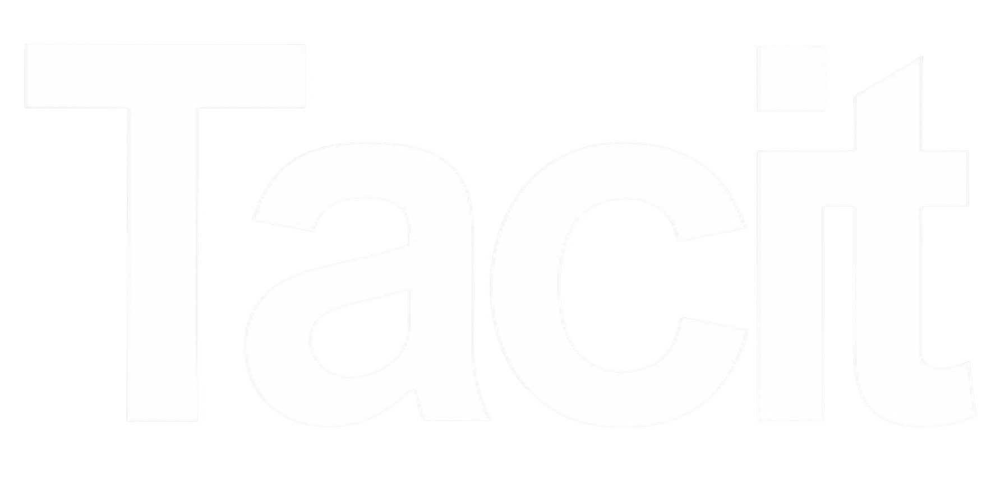
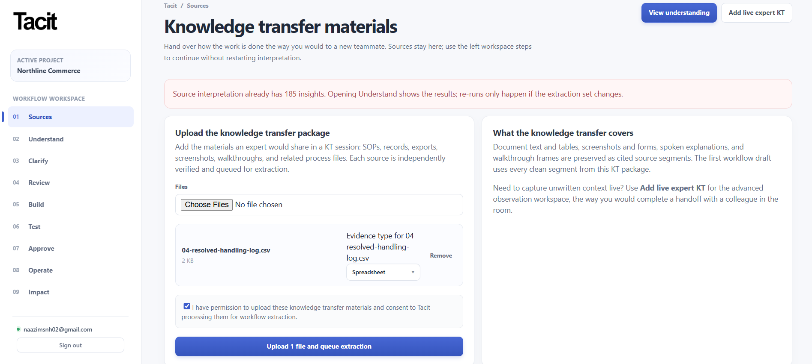
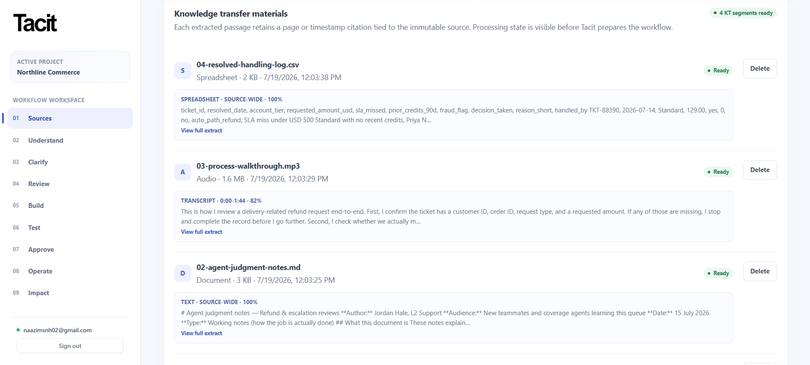
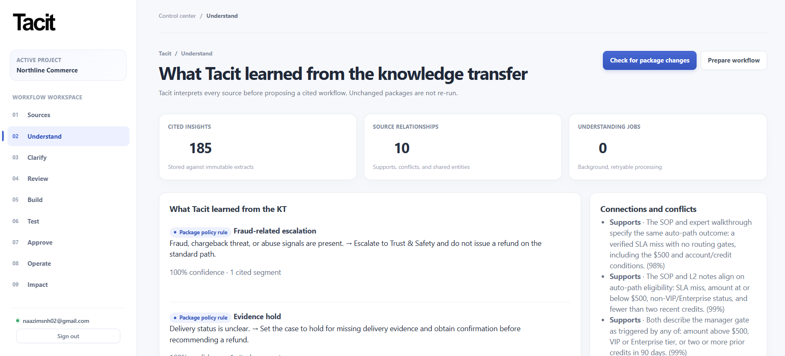
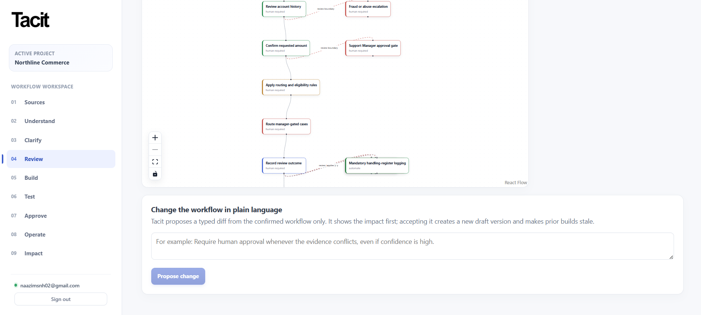
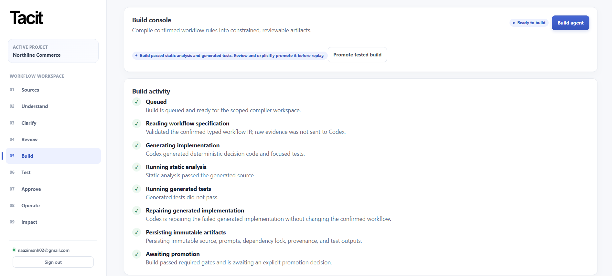
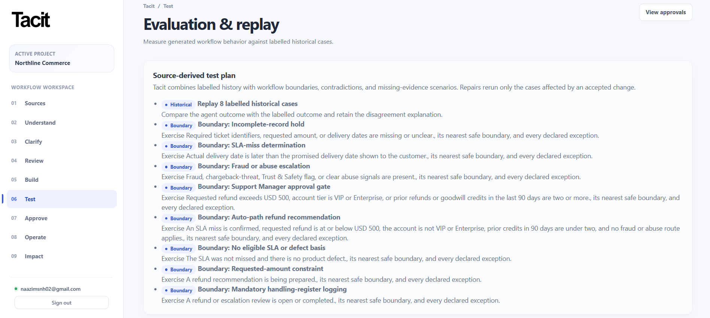
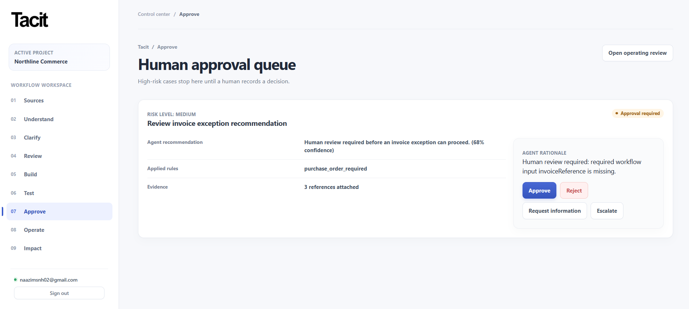
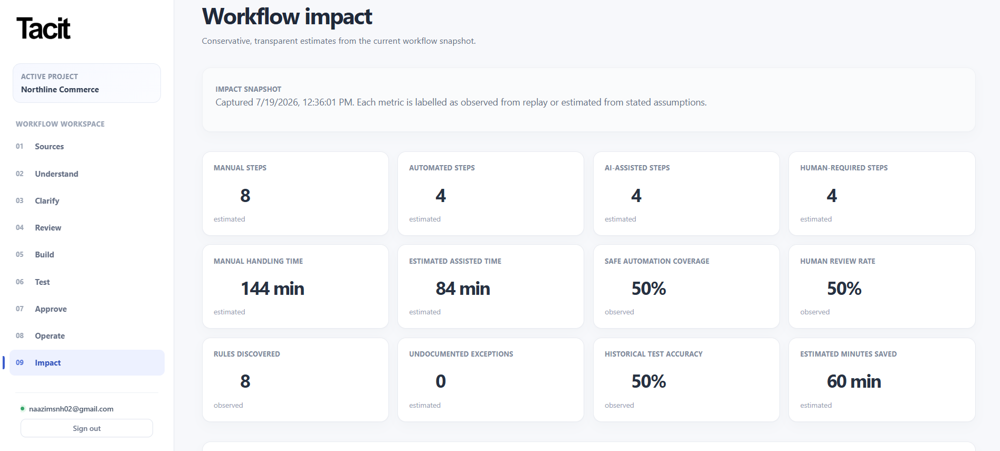
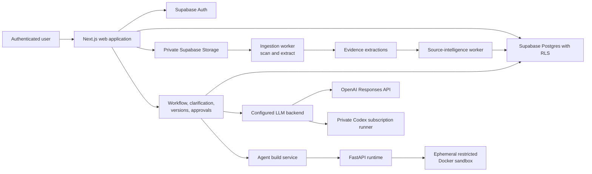

<p align="center">
  
</p>

<p align="center">
  <strong>From expert knowledge to trusted AI agents.</strong>
</p>

<p align="center">
  <strong>Teach AI how work really gets done.</strong>
</p>

<p align="center">
  Tacit learns from your documents, walkthroughs, examples, and expert judgment, then turns that knowledge into a cited workflow and a supervised AI agent your team can inspect, test, and approve.
</p>

<p align="center">
  <a href="#how-tacit-works">How it works</a> ·
  <a href="#product-capabilities">Capabilities</a> ·
  <a href="#architecture">Architecture</a> ·
  <a href="#getting-started">Getting started</a> ·
  <a href="#hackathon">Hackathon</a>
</p>

<p align="center">
  
  
  
  
  
  
  
</p>

> There is no public deployment URL or public demo URL configured in this repository. Run the application locally using the instructions below.

## AI Development & Model Stack (Codex, GPT-5.6, Terra, & Luma)

Tacit was built for the [OpenAI Build Week](https://openai.devpost.com/) in the **Work & Productivity** track. The product demonstrates a complete path from expert knowledge transfer to a cited workflow, a constrained Codex-assisted build, historical replay, and human approval boundaries.

### Full Development Support
We used **Codex** and **GPT-5.6** to drive the **full development** of the entire codebase, including frontend/backend design, implementation, and overall development support. They assisted in drafting Next.js components, writing FastAPI code, defining Postgres schemas & RLS policies, designing the AST validation logic, constructing test suites, and configuring background ingestion workers.

<details open>
<summary>Recorded Codex feedback sessions</summary>

| Milestone | Session ID |
| --- | --- |
| 0 | `019f6550-4f79-7ea1-bfcb-0ff381635ee5` |
| 1 | `019f656f-697c-7372-9ebe-e20acad2dec6` |
| 2 | `019f65a1-b896-78d0-bb9a-6b17bf069623` |
| 3 | `019f65bd-a0c0-7e30-af90-f358681c505a` |
| 4 | `019f65d6-5790-73e1-8237-a725a98bb0f7` |
| 5 | `019f6611-6752-7de2-8fe7-7add76cb2cee` |
| 6 | `019f6626-7c7e-7c83-a243-43eb24186587` |
| 7 | `019f6644-00a9-7ca2-909b-6ae90b2d1bb1` |
| 8 | `019f6688-b0b8-7d41-841c-6c0200573854` |
| 9 | `019f66a7-67b3-79d3-a8e7-517f4de8ab9c` |
| 10 | `019f6868-2613-7870-91d4-7a43892ee49e` |
| 11 | `019f6872-6d2b-73d1-84f0-52a3e870aa1f` |

</details>

### Production Model Integration
The application itself integrates multiple specialized models across its core workflow extraction, validation, and execution processes:

- **Codex & GPT-5.6 (Workflow Synthesis & Code Compilation)**: Used during the *Compilation* and *Clarification* phases to translate confirmed, human-approved workflow graphs into executable Python code (AST-checked scripts) and generate risk-ranked clarification questions.
- **Terra (Semantic Logic & Contradiction Checks)**: Powers semantic analysis, cross-source contradiction checks, and structural insight extraction inside the **Understand** stage. It analyzes source relationships and identifies conflicting rules before drafting the workflow.
- **Luma (Visual Context & Ingestion Processing)**: Integrates with the **Sources** ingestion worker to analyze video frame sequences, inspect visual walkthroughs, match screen states against steps, and perform OCR/image parsing on expert materials.

## The problem

SOPs describe the intended process, but the operational knowledge that makes a process safe usually lives elsewhere: judgment calls, workarounds, exceptions, and the moments when a person decides to stop and ask for approval.

Traditional automation often begins with incomplete documentation. Tacit begins with a knowledge transfer package, then keeps the resulting process tied to the evidence and expert decisions that support it. The result is not an opaque recommendation: it is a workflow that can be inspected, clarified, versioned, tested, and governed.

## How Tacit works

The production workspace follows this path:

1. **Create an organization and project.** Signed-in users create tenant-owned projects for a knowledge-transfer effort.
2. **Add knowledge-transfer materials.** Upload SOPs, documents, spreadsheets, images, audio, and video. Tacit records processing consent, checks files before extraction, and retains page- or timestamp-level source references where available.
3. **Understand the package.** Background workers extract source material and prepare cited insights, cross-source relationships, and process structure. An optional live-expert workspace can add evidence-linked narration and imported browser events.
4. **Prepare and clarify the workflow.** Tacit creates a draft workflow from processed sources, then asks risk-ranked questions for rules it cannot safely infer. A response creates a new workflow version; unresolved questions remain supervised.
5. **Review and confirm policy.** Teams inspect the workflow graph, evidence state, confidence, rules, risk, and automation recommendations. A subject-matter expert must confirm rules, contradictions, automation boundaries, and approval policies before a production build starts.
6. **Build a supervised agent.** Tacit generates constrained Python artifacts and generated tests from the confirmed workflow, not from raw, unreviewed source files. Static validation and generated tests run before a build can be promoted.
7. **Test and approve.** Import labelled historical cases, replay a promoted build, inspect per-case results, and run supervised cases. Cases requiring review create approval requests with the agent rationale, applied rules, and evidence references.
8. **Operate with review.** Deployment-readiness recommendations account for replay accuracy, open clarifications, and contradictions. Operating feedback is retained as evidence and cannot silently alter a promoted workflow.

## Product capabilities

### Knowledge-transfer workspace

Tacit gives each project a dedicated workspace for the material an expert would hand to a new colleague. It accepts these file-based evidence types:

| Source type | Supported formats | Processing in the repository |
| --- | --- | --- |
| SOP or document | PDF, DOCX, TXT, Markdown | Text extraction with page references where applicable |
| Spreadsheet | CSV, XLSX | Structured extraction |
| Image | PNG, JPG, JPEG, WebP | OCR and source-intelligence processing |
| Audio | MP3, M4A, WAV, WebM | Configured transcription with timestamped segments |
| Video | MP4, MOV, WebM | Audio transcription plus sampled visual frames |

Uploads are direct-to-storage after server-side validation. The intake flow requires an explicit consent acknowledgement, shows scan/extraction state, permits deletion, and supports retrying failed processing. 

### Evidence-backed process understanding

Once source files are clean and extracted, Tacit queues source-intelligence jobs. The **Understand** stage displays cited insights, relationships such as support or conflict, confidence, and job status. It prepares a workflow only from the current processed package, so an unchanged package is not silently reinterpreted.

The optional **Add live expert KT** route supplements source understanding with evidence-linked expert notes, manually recorded steps, and imported browser events.

### Clarification, review, and workflow versions

Tacit identifies decision rules, contradictions, confidence, and evidence links in a workflow graph. Selecting a graph node reveals inputs, outputs, evidence, risk, verification state, and its automation recommendation.

Clarification questions are ranked by risk and rule impact. Experts can answer or defer a question; an answer creates a new workflow version, while a deferral keeps the affected decision supervised. The review stage also accepts a plain-language workflow change request, produces a typed change proposal with impact and risk information, and creates a new draft version only after acceptance. Existing builds become stale after an accepted change.

### Supervised agent compilation

The **Build** stage is intentionally gated by SME workflow confirmation. It streams build activity for workflow reading, generation, static analysis, generated tests, repair attempts, immutable-artifact persistence, and promotion.

Generated Python is treated as untrusted. The runtime parses its AST, allows only approved imports, rejects dangerous modules and calls, requires a stable `evaluate(payload)` entry point, and runs validation/tests/execution in a one-shot Docker container with no network, a read-only filesystem, dropped capabilities, an unprivileged user, and bounded CPU, memory, process, file-descriptor, input, and output limits.

### Historical replay, supervised cases, and approvals

The **Test** stage imports labelled historical cases from CSV and creates a source-derived test plan from workflow boundaries, contradictions, and missing-evidence scenarios. Replay compares a promoted build with labelled outcomes and exposes metrics and individual case results. A single supervised case may be run separately; when it requires human review, Tacit creates an approval request rather than treating it as a replay result.

The **Approve** queue records approved, rejected, escalated, or information-requested decisions. Each request exposes the agent recommendation, confidence when available, applied rules, evidence-reference count, and rationale. Decisions are retained in the audit trail.

### Readiness, operating feedback, and impact

**Operate** presents a readiness recommendation based on the latest workflow, replay accuracy, unresolved clarifications, and open contradictions. It can record supervised outcomes, overrides, and other operating observations as evidence for later review. It does not allow that feedback to rewrite an active workflow automatically.

**Impact** presents the latest project snapshot, including workflow steps, safe automation coverage, review rate, rules and exceptions discovered, historical accuracy, and estimated handling-time changes. The screen labels the snapshot as a conservative, transparent estimate; it is not a real-time external analytics integration.

## Application navigation

The authenticated project sidebar contains the following production areas.

| Area | What users can do there |
| --- | --- |
| **Sources** | Upload, classify, monitor, retry, inspect, and delete knowledge-transfer files; start source understanding or add live expert KT. |
| **Understand** | View cited source insights, cross-source relationships, background-job status, and prepare a workflow from the processed package. |
| **Clarify** | Answer or defer risk-ranked clarification questions and confirm a reviewed workflow for building. |
| **Review** | Inspect the workflow graph and evidence state; request, review, accept, or reject plain-language change proposals. |
| **Build** | Generate, validate, test, repair, and explicitly promote a constrained agent build. |
| **Test** | Import labelled historical cases, view a source-derived test plan, replay a promoted build, and run a supervised case. |
| **Approve** | Review approval requests and record an approval, rejection, escalation, or request for more information. |
| **Operate** | Review deployment readiness and retain supervised operating outcomes without silently changing the workflow. |
| **Impact** | Inspect the latest conservative workflow-impact snapshot and its data sources. |

## How Tacit is governed

Tacit’s control model is implemented as product gates rather than a claim of autonomous operation:

- **Durable evidence:** workflow steps, rules, questions, and approvals retain evidence identifiers. Extracted text carries page spans or media timestamps where applicable.
- **Explicit uncertainty:** unresolved or deferred clarification questions constrain affected actions to supervision.
- **Human confirmation:** a production build requires confirmation that rules, contradictions, automation boundaries, and approval policies have been reviewed.
- **Versioned change:** answered questions and accepted change proposals create workflow versions; they do not edit an already confirmed policy in place.
- **Promotion and testing:** a build must pass static analysis and generated tests, then be explicitly promoted before historical replay uses it.
- **Human approval boundaries:** high-risk or human-review outcomes create approval requests for an authenticated user to decide.
- **Auditability:** organizations, projects, workflow versions, build logs, test runs/results, approvals/actions, impact snapshots, operating observations, and audit events are persisted in the Supabase schema.

These controls do not constitute a compliance certification and Tacit does not perform high-risk external actions such as releasing payments autonomously.

## Product walkthrough

The repository includes current application screenshots from the primary workspace journey.

<p align="center">
  
</p>

<p align="center"><em>Sources Input: Add process documentation, walkthrough videos, and files to the project.</em></p>

<p align="center">
  
</p>

<p align="center"><em>Sources: Reviewed knowledge-transfer materials retain extraction and processing state.</em></p>

<p align="center">
  
</p>

<p align="center"><em>Understand: Cited insights, source relationships, and processing status before workflow preparation.</em></p>

<p align="center">
  
</p>

<p align="center"><em>Review: Workflow nodes expose review boundaries, and changes are proposed before creating a new version.</em></p>

<p align="center">
  
</p>

<p align="center"><em>Build: Stream sandbox compilation, AST validation, and test runner execution for the agent.</em></p>

<p align="center">
  
</p>

<p align="center"><em>Test: Source-derived boundaries and labelled history support replay before wider use.</em></p>

<p align="center">
  
</p>

<p align="center"><em>Approve: Audit logs and human-in-the-loop manual override queues for policy governance.</em></p>

<p align="center">
  
</p>

<p align="center"><em>Impact: Real-time business metrics tracking automation rate, accuracy, and operational savings.</em></p>

## Technology stack

| Area | Implementation |
| --- | --- |
| Web application | Next.js 15 App Router, React 19, TypeScript, and custom CSS components |
| Workflow visualisation | React Flow via `@xyflow/react` |
| Application APIs | Next.js route handlers with Zod validation and build-progress streaming |
| Runtime and workers | FastAPI, Python 3.11, Pydantic, and Docker |
| Data, identity, and storage | Supabase Auth, Postgres, Row Level Security, and private Storage accessed through Supabase APIs |
| AI | Codex & GPT-5.6 (compilation, clarification), Terra (semantic/contradiction checks), and Luma (vision/visual ingestion paths) |
| Evidence processing | ClamAV, pypdf, python-docx, openpyxl, Tesseract OCR, FFmpeg, and optional OpenAI or Modal transcription |
| Quality | Vitest, Playwright, pytest, Ruff, ESLint, and TypeScript project references |

There is no ORM, hosted deployment configuration, observability vendor, Tailwind dependency, or shadcn/ui dependency in the current repository.

## Architecture



The workspace persists generic project, evidence, observation, workflow, build, evaluation, approval, and impact records. Workflow-specific schemas and demo data are loaded through workflow packs. The first detailed pack is **Invoice Exception Review**; a separate sample-support pack supplies a demo fixture. The core project creation path uses `generic_process` and does not add invoice fields to the shared model.

## Data and AI flow

1. A project member uploads validated source files after acknowledging processing consent.
2. The ingestion worker scans the source, extracts text/transcripts/frames, and stores durable extraction records.
3. The source-intelligence worker interprets scan-cleared sources into cited insights and relationships.
4. Tacit turns the processed package (and, when used, live expert KT events) into a draft workflow with evidence references.
5. Experts resolve high-impact questions and explicitly confirm policy boundaries.
6. The configured model generates a constrained agent and tests from the confirmed typed workflow.
7. The FastAPI runtime statically validates and executes generated artifacts inside the restricted container.
8. Historical replay, approval outcomes, readiness assessments, and operating observations create records for review; new operating feedback remains separate until a reviewed change is accepted.

## Getting started

### Prerequisites

- Node.js 20+ and npm 10+ (the repository uses `package-lock.json`)
- Python 3.11+
- Docker Desktop, including permission to run local containers
- A Supabase project with Auth, Postgres, and Storage
- An AI configuration: OpenAI API credentials and approved model IDs, or a private Codex-subscription runner configuration

### Install dependencies

```bash
npm install
python -m pip install -e apps/agent-runtime
python -m pip install ruff
```

### Configure environment files

Copy the supplied templates. The root `.env` is used by Docker Compose and Python workers; `apps/web/.env.local` is used when running Next.js outside Compose.

```bash
cp .env.example .env
cp apps/web/.env.local.example apps/web/.env.local
```

On Windows PowerShell:

```powershell
Copy-Item .env.example .env
Copy-Item apps/web/.env.local.example apps/web/.env.local
```

Configure the variables described in [Environment variables](#environment-variables). Keep service-role keys, model-provider credentials, and runner secrets out of client code and source control.

### Prepare Supabase and the sandbox

Apply the ordered SQL files in `supabase/migrations/` using the approved migration workflow for the target Supabase environment. The repository does not include a Supabase CLI configuration, so it does not prescribe a `supabase db push` command.

Build the image used by the isolated generated-agent runtime:

```bash
docker build -f apps/agent-runtime/Dockerfile.sandbox -t tacit-agent-sandbox:latest apps/agent-runtime
```

### Run the complete local stack

The Compose stack starts the Next.js web app, FastAPI runtime, ingestion worker, source-intelligence worker, Codex runner, and ClamAV. The sandbox image must already exist.

```bash
docker build -f apps/agent-runtime/Dockerfile.sandbox -t tacit-agent-sandbox:latest apps/agent-runtime
docker compose up --build -d
docker compose logs -f web codex-runner agent-runtime ingestion-worker source-intelligence-worker
```

Open `http://localhost:3000`, sign in at `/projects`, and create an organization and project. The web health endpoint is available at `http://localhost:3000/api/health`; the runtime health endpoint is `http://localhost:8000/health`.

`NEXT_PUBLIC_SUPABASE_URL` and `NEXT_PUBLIC_SUPABASE_ANON_KEY` must be present in the root `.env` before the web image is built because Next.js inlines public values into the browser bundle.

### Run web and runtime locally

For UI and runtime development without starting the whole Compose topology:

```bash
npm run dev
npm run runtime:dev
```

Evidence ingestion and source understanding still require their supporting services. Start the runner and scanner, then start each worker from `apps/agent-runtime` after installing Python dependencies:

```bash
docker compose up -d codex-runner clamav
cd apps/agent-runtime
python -m app.ingestion_worker
python -m app.source_intelligence_worker
```

### Use the Codex-subscription runner

When `LLM_BACKEND=codex_subscription`, set the runner URL, secret, and model in both applicable environment files. Start the private runner and complete its one-time device-code sign-in:

```bash
docker compose up -d codex-runner
docker compose exec codex-runner python -m app.codex_login
```

The runner is exposed only on loopback by Compose and keeps its sign-in state in the named `codex-subscription-auth` Docker volume. Do not expose it publicly or share its credential volume.

## Environment variables

The following table is derived from `.env.example`, `apps/web/.env.local.example`, the Next.js environment validator, Compose configuration, and the Python workers. Empty values in the templates are placeholders.

| Variable | Required | Purpose |
| --- | --- | --- |
| `NEXT_PUBLIC_SUPABASE_URL` | Yes | Supabase project URL; used by browser auth and server persistence. |
| `NEXT_PUBLIC_SUPABASE_ANON_KEY` | Yes | Supabase anonymous key for browser authentication. |
| `SUPABASE_SERVICE_ROLE_KEY` | Yes, server only | Server/worker access to Supabase persistence and Storage. Never expose it to the browser. |
| `AGENT_RUNTIME_URL` | Yes | Base URL for the FastAPI generated-agent runtime. |
| `LLM_BACKEND` | Yes | Choose `openai_api` (default) or `codex_subscription`. |
| `OPENAI_API_KEY` | Required for `openai_api`; also required for OpenAI transcription or source intelligence | Server-side OpenAI credential. |
| `OPENAI_REASONING_MODEL`, `OPENAI_DEFAULT_MODEL`, `OPENAI_FAST_MODEL`, `OPENAI_CODEX_MODEL` | Required when `LLM_BACKEND=openai_api` | Environment-configured model IDs validated by the web application. |
| `CODEX_SUBSCRIPTION_RUNNER_URL`, `CODEX_SUBSCRIPTION_RUNNER_SECRET`, `CODEX_SUBSCRIPTION_MODEL` | Required when `LLM_BACKEND=codex_subscription` | Private runner endpoint, 32+-character shared secret, and configured subscription model. |
| `CODEX_SUBSCRIPTION_TIMEOUT_SECONDS`, `CODEX_SUBSCRIPTION_MAX_IMAGES`, `CODEX_SUBSCRIPTION_MAX_IMAGE_PAYLOAD_BYTES` | Optional | Limits for the private runner; defaults are supplied by Compose/template. |
| `EVIDENCE_TRANSCRIPTION_MODEL` | Required when audio/video use OpenAI transcription | Configured OpenAI transcription model ID. |
| `EVIDENCE_TRANSCRIPTION_PROVIDER` | Optional | Default transcription provider: `openai` or `modal`. |
| `EVIDENCE_AUDIO_TRANSCRIPTION_PROVIDER`, `EVIDENCE_VIDEO_TRANSCRIPTION_PROVIDER` | Optional | Override the default provider for audio or video. |
| `EVIDENCE_MODAL_TRANSCRIPTION_URL`, `EVIDENCE_MODAL_PROXY_AUTH_KEY`, `EVIDENCE_MODAL_PROXY_AUTH_SECRET` | Required only for Modal transcription | Modal transcription endpoint and server-side credentials. |
| `EVIDENCE_SOURCE_INTELLIGENCE_BACKEND`, `EVIDENCE_VISION_MODEL` | Required for the corresponding configured source-intelligence path | Select an explicit source-intelligence backend when needed and supply its vision-capable model. |
| `EVIDENCE_VISION_DETAIL`, `EVIDENCE_VISION_ESCALATION_DETAIL`, `EVIDENCE_VISION_MIN_CONFIDENCE`, `EVIDENCE_SOURCE_MAX_TEXT_CHARS` | Optional | Source-intelligence detail, confidence, and text limits. |
| `EVIDENCE_VIDEO_COVERAGE_SECONDS`, `EVIDENCE_VIDEO_MAX_FRAMES`, `EVIDENCE_VIDEO_SCENE_THRESHOLD`, `EVIDENCE_VIDEO_FRAME_BATCH_SIZE` | Optional | Video sampling and visual-analysis limits. |
| `EVIDENCE_WORKER_POLL_SECONDS`, `SOURCE_INTELLIGENCE_WORKER_POLL_SECONDS` | Optional | Worker polling intervals; Compose supplies defaults. |
| `AGENT_EXECUTION_TIMEOUT_SECONDS`, `AGENT_SANDBOX_IMAGE` | Optional | Generated-agent execution timeout and sandbox image name. |
| `PILOT_MAX_ACTIVE_PROJECTS_PER_ORGANIZATION` | Optional | Per-organization active-project limit; defaults to `5`. |
| `NEXT_PUBLIC_DEMO_MODE_ENABLED` | Optional | Enables the explicit seeded `/demo` route; defaults to `true`. |

## Project structure

```text
apps/
  web/                         Next.js UI, authenticated routes, and API handlers
  agent-runtime/               FastAPI runtime, ingestion, and source-intelligence workers
packages/
  core-schemas/                Shared Zod contracts for platform records
  prompts/                     Prompt construction shared by product services
  workflow-sdk/                Workflow-pack definitions and utilities
  workflow-registry/           Pack registration and lookup
supabase/
  migrations/                  Postgres, RLS, Storage, audit, and worker-job migrations
scripts/                       Seed and explicit demo-reset scripts
generated/                     Local generated-agent workspaces and artifacts
```

## Available scripts

Run these commands from the repository root.

| Command | Purpose |
| --- | --- |
| `npm run dev` | Start the Next.js web app. |
| `npm run build` | Create the production web build. |
| `npm run lint` | Run ESLint across the repository. |
| `npm run typecheck` | Run the TypeScript project-reference build. |
| `npm run test` | Run Vitest unit and integration tests. |
| `npm run test:e2e` | Run Playwright end-to-end tests. |
| `npm run seed` | Run the repository seed script with `.env` if present. |
| `npm run demo:reset` | Explicitly reset seeded demo data; do not use this against customer data. |
| `npm run runtime:dev` | Start the FastAPI runtime with reload. |
| `npm run runtime:lint` | Run Ruff on the agent runtime. |
| `npm run runtime:test` | Run pytest for the agent runtime. |

## Testing and quality

The repository includes Vitest coverage for shared schemas, workflow packs, source understanding, reconstruction, clarification, agent builds, API routes, tenant access, evidence processing, and navigation; Playwright configuration for web end-to-end tests; and pytest coverage for the Python runtime and sandbox checks.

Run the standard checks:

```bash
npm run lint
npm run typecheck
npm run test
npm run runtime:lint
npm run runtime:test
npm run build
```

`npm run test:e2e` starts the web test server on port 3100 through Playwright. It may require valid local environment configuration for routes that depend on Supabase or other services.

The in-product **Test** stage is separate from this developer test suite: it evaluates a promoted generated build against tenant-owned labelled historical cases and source-derived boundaries.

## Deployment model

This repository supports a local, Compose-based production-style topology. It requires Supabase, a configured AI backend, Docker, the agent sandbox image, and the worker services required for the chosen source types. Compose builds the Next.js image and starts web, runtime, workers, private Codex runner, and ClamAV.

Before deploying to any remote environment, apply the ordered Supabase migrations to that environment, configure storage and auth, provide server-side secrets, build the sandbox image, and ensure the runtime can launch isolated containers. No Vercel, cloud-hosting, CI/CD, or managed worker deployment configuration is committed here.

## Current implementation status and boundaries

| Status | What it means in this repository |
| --- | --- |
| **Implemented production path** | Authenticated organizations and projects; tenant-scoped evidence intake; source extraction/intelligence; workflow drafting, clarification, confirmation, versions, and graph review; constrained builds; historical replay; approval decisions; readiness; operating observations; and impact snapshots. |
| **Implemented with local infrastructure prerequisites** | Malware scanning, OCR/media extraction, source-intelligence jobs, transcription, isolated generated-agent execution, and the private Codex runner require their configured local or deployed supporting services. |
| **Demo only** | `/demo`, Invoice Exception Review seed fixtures, guided demo controls, sample-support fixtures, and `npm run demo:reset`. These are explicitly separated from production projects. |
| **Not currently exposed as product capabilities** | Link/pasted-text intake, generic desktop capture, customer-facing connector management, arbitrary ERP/SaaS integrations, public hosted deployment, and autonomous high-risk actions. |

## Security and responsible use

- Supabase Auth and Postgres RLS policies scope organizations, memberships, projects, workflow records, test results, approvals, and Storage access.
- Project APIs authorize authenticated membership before reading or writing tenant data. Selected mutation routes enforce in-process rate limits.
- Evidence upload validation checks extension, MIME type, size, checksum, and processing consent; the worker fails closed when the malware scanner is unavailable or rejects a file.
- Generated code is stored under the local generated-artifact root, validated before execution, and run in a restricted ephemeral container as described in [Supervised agent compilation](#supervised-agent-compilation).
- The app records audit and operational records, but it does not claim SOC 2, ISO 27001, HIPAA, GDPR, or other compliance certification.

## License

This project is licensed under the MIT License. See the [LICENSE](LICENSE) file for details.
